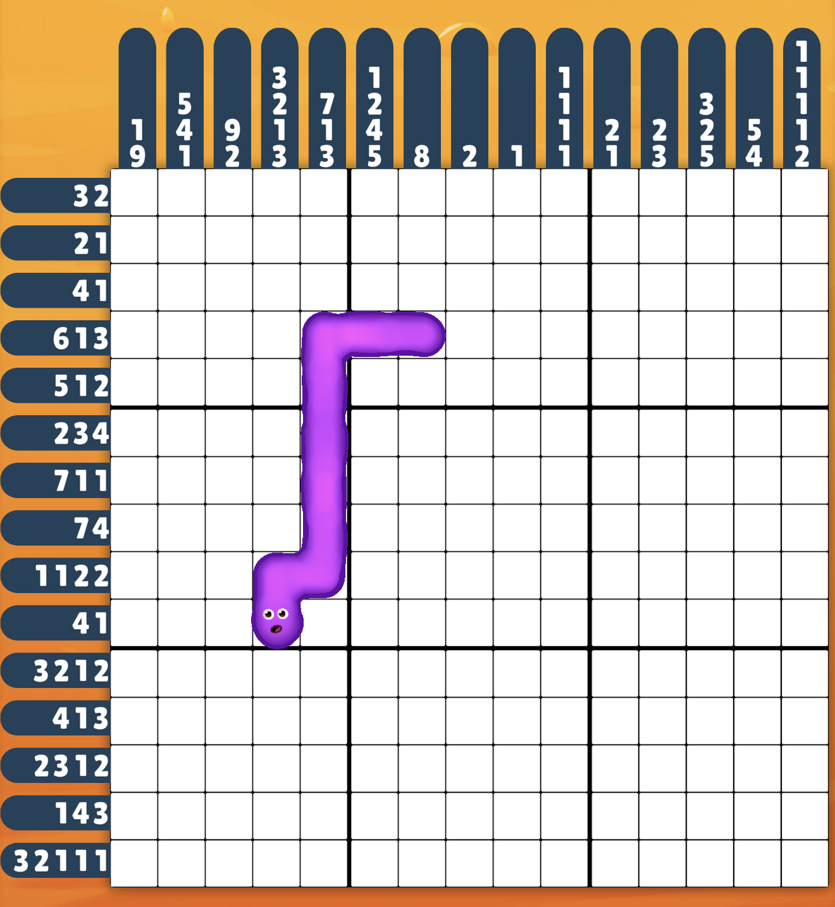
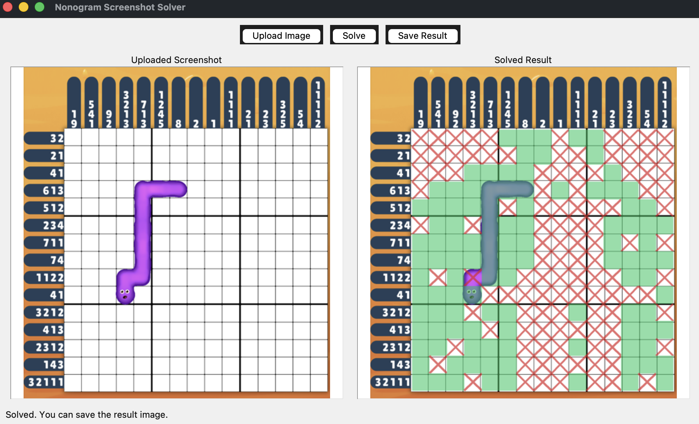
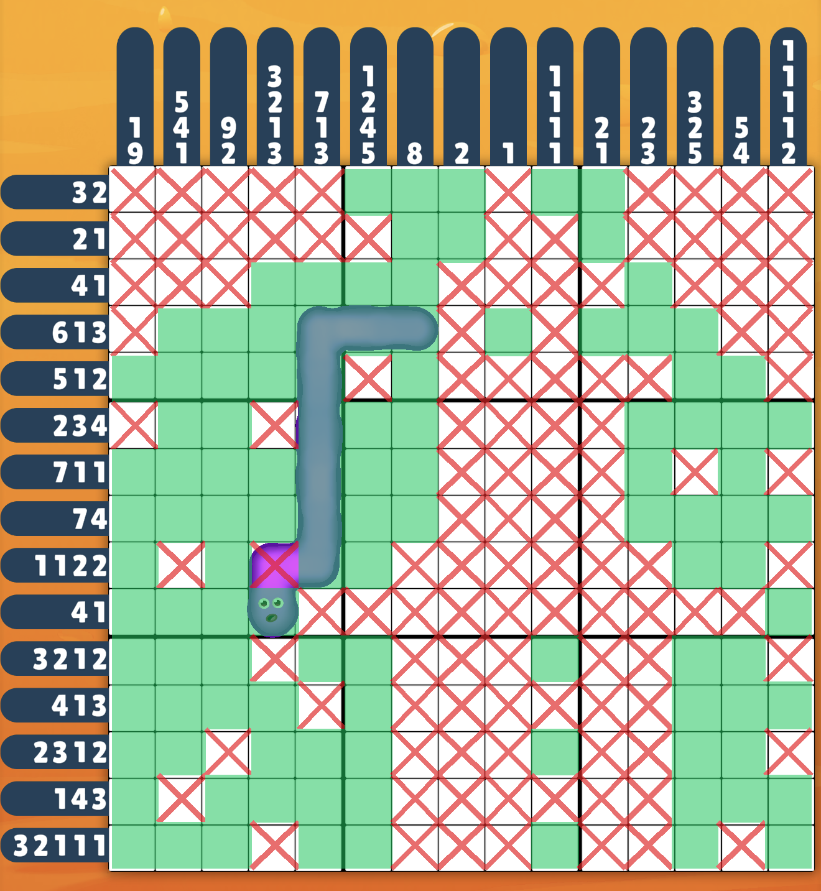

# Nonogram Screenshot Solver

Upload a screenshot of a Nonogram (picross) puzzle and get back the same screenshot with the
solution filled in — computer vision reads the grid, clues, and current board state; a
constraint-propagation solver (with a backtracking fallback) completes it.

```
Open App → Upload Screenshot → Solve → Result Image
```

That's the entire workflow. No puzzle editor, no manual clue entry, no game mode — just
upload, solve, done.

---

## Features

- 🖼️ **Upload a screenshot** from a file picker — no manual data entry
- 🔲 **Automatic puzzle detection** — finds the board and straightens out minor perspective skew
- 🔢 **OCR for row and column clues** — reads the numbers off the clue badges automatically
- 🎨 **Filled/crossed cell detection** — HSV color segmentation tells filled, crossed, and unknown cells apart
- 🧩 **Automatic solving** — constraint propagation ("line solving") plus a backtracking layer, so the
  solver always finishes the puzzle if a valid solution exists
- 🖥️ **Solved puzzle display** — the solution is overlaid directly on your original screenshot
- 💾 **Save the result** — export the solved image to a file

---

## Screenshots

> Placeholders — see [docs/screenshots/](docs/screenshots/) for what to add.

| Original Puzzle | Detected Grid | Solved Result |
| --- | --- | --- |
|  |  |  |

---

## Installation

**Requirements:** Python 3.9+ **with a working Tk**, and [Tesseract OCR](https://github.com/tesseract-ocr/tesseract)
installed on your system.

> **macOS note:** don't use the system/Command Line Tools Python for this. It bundles Tk 8.5
> (from 2009), which predates Dark Mode and renders this app's window entirely blank on modern
> macOS — not a bug in this app, a broken Tk on a modern OS. Use a Homebrew Python instead,
> which links against a modern Tcl/Tk:
>
> ```bash
> brew install tesseract python-tk@3.12   # installs a modern Tcl/Tk alongside Python 3.12
> python3.12 -m venv .venv                # use the Homebrew python3.12, not /usr/bin/python3
> ```
>
> If the window ever renders blank, run
> `python3 -c "import tkinter as tk; print(tk.Tk().call('info','patchlevel'))"` — if it prints
> `8.5.x`, you're on the broken system Tk and need to switch interpreters as above.

**On Linux:** `apt install tesseract-ocr python3-tk`

**On Windows:** install [Tesseract](https://github.com/UB-Mannheim/tesseract/wiki) and add it to
your `PATH`; the standard python.org installer already ships a working Tk.

### Setup

```bash
git clone https://github.com/<your-username>/nonogram-screenshot-solver.git
cd nonogram-screenshot-solver

python3.12 -m venv .venv
source .venv/bin/activate        # Windows: .venv\Scripts\activate

pip install -r requirements.txt
```

In VS Code, select this environment via **Cmd/Ctrl+Shift+P → Python: Select Interpreter → .venv**.
A ready-made `.vscode/launch.json` is included for one-click Run/Debug.

---

## Usage

1. Launch the application: `python -m app.main`
2. Click **Upload Image**.
3. Select a screenshot of the puzzle.
4. Click **Solve**.
5. View the solution overlaid on your screenshot.
6. Click **Save Result** to export it.

---

## Project Structure

```
app/       Application entry point (python -m app.main)
ui/        The single application window: upload / preview / solve / result / save
vision/    Screenshot -> Puzzle (grid detection, clue OCR, cell classification),
           and solved board -> overlay image
solver/    The nonogram solving engine (line-solving, unchanged from the original
           algorithm) plus a backtracking layer, behind a small reusable API
models/    Shared data types (Puzzle, CellState)
tests/     Unit tests for the solver, backtracking search, and OCR
```

---

## Technologies Used

- **Python** — application language
- **OpenCV** (`opencv-python-headless`) — image loading, perspective correction, grid/cell
  detection, color segmentation
- **NumPy** — array operations underlying the vision pipeline
- **Pillow (PIL)** — image compositing for the solved-puzzle overlay and the UI preview
- **Tesseract OCR** (via `pytesseract`) — clue digit recognition
- **Tkinter** — the desktop UI (ships with Python)
- **A constraint-propagation Nonogram solver** — the original line-solving algorithm from
  [bbukaty/nonograms](https://github.com/bbukaty/nonograms), reused and extended (see
  [Credits](#credits--acknowledgements))

---

## How It Works

1. **Load image** — read the uploaded screenshot.
2. **Detect puzzle** — straighten perspective skew, then locate the board's row/column clue
   badges to determine its size and cell geometry.
3. **OCR clues** — read the row and column clue numbers off their badges.
4. **Detect board state** — classify every cell as filled, crossed out, or unknown.
5. **Solve puzzle** — run the clues and current board through the solver.
6. **Render solution** — overlay the newly-solved cells on the original screenshot; cells
   that were already visible are left untouched.

---

## Development

Run the test suite:

```bash
source .venv/bin/activate
python -m unittest discover tests
```

If detection doesn't work cleanly on a screenshot from a different puzzle size or a visual
theme variant, the constants near the top of `vision/grid_detector.py`, `vision/cell_detector.py`,
and `vision/ocr.py` are the place to retune — in particular `_NAVY_MIN_VALUE`/`_NAVY_MAX_VALUE`
in `grid_detector.py` (clue badge color) and the HSV ranges in `cell_detector.py` (fill/cross
color). See [CONTRIBUTING.md](CONTRIBUTING.md) for more.

---

## Limitations

- **Tuned for one mobile game's screenshot style.** The vision pipeline is deliberately
  narrow (clue badge shape/position, fill/cross tile colors), not a generic Nonogram-image
  parser. A different game's screenshot will likely need the color/geometry constants in
  `vision/` retuned.
- **Assumes single-digit clue values (0–9).** This matches every puzzle size the target game
  uses; a game with double-digit clue values in one slot isn't supported.
- **Requires Tesseract OCR installed locally** — it isn't bundled with the app.
- **Not built for arbitrary photos.** Perspective correction handles minor skew, not a photo
  of a phone screen taken at an angle with glare/reflections.
- **Backtracking is exponential in the worst case.** In practice it resolves real puzzles in
  well under a second, but a pathological puzzle with very little clue information could be
  slow.
- **A screenshot captured mid-animation/mid-load can have inconsistent clue data** (e.g. a
  badge that hadn't finished rendering). The app detects this specific case — row and column
  clue totals must always agree — and reports it clearly rather than misdetecting a solution.

---

## Future Improvements

- Configurable per-game "profiles" (colors, badge layout) instead of one hardcoded theme
- Drag-and-drop image upload
- Clipboard paste support (upload directly from a copied screenshot)
- Batch-solve multiple screenshots in one run
- Packaged standalone builds (`.app` / `.exe`) so end users don't need a Python environment
- Optional interactive board editor for manually correcting a misread cell before solving

---

## Contributing

Contributions are welcome — see [CONTRIBUTING.md](CONTRIBUTING.md) for setup notes and what
to keep in mind before changing the solver or vision pipeline. Please also review the
[Code of Conduct](CODE_OF_CONDUCT.md). Release history is tracked in [CHANGELOG.md](CHANGELOG.md).

---

## License

Licensed under the [MIT License](LICENSE) — see the LICENSE file for the full text. This
project builds on MIT-licensed code from bbukaty/nonograms, so it remains MIT-licensed in
turn.

---

## Credits & Acknowledgements

This project reuses and builds upon ideas and code from
**[bbukaty/nonograms](https://github.com/bbukaty/nonograms)**.

Many thanks to the original author for creating and open-sourcing the Nonogram solving
algorithm that made this project possible. The original repository's line-solving
constraint-propagation engine is preserved essentially unchanged in `solver/engine.py`; this
project adds a screenshot-based computer vision pipeline, a backtracking layer, and a desktop
UI around it.

This project is an independent derivative work and is **not officially affiliated with** the
original repository or its author.
